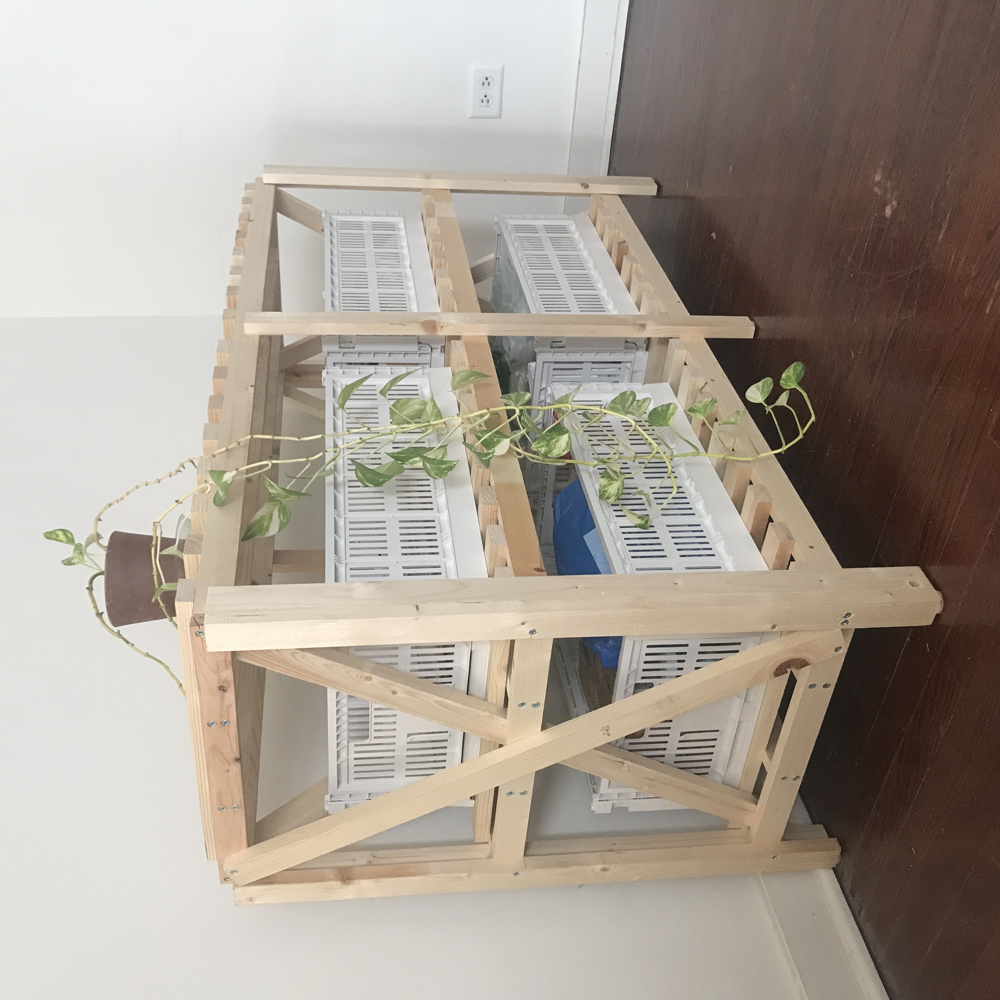
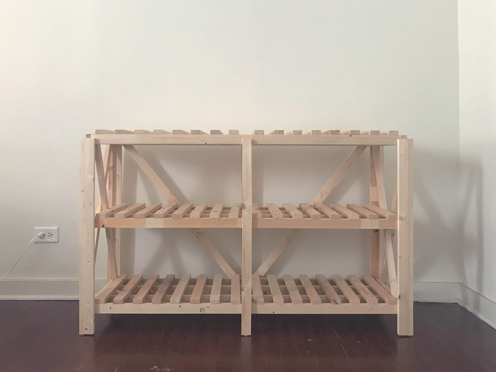
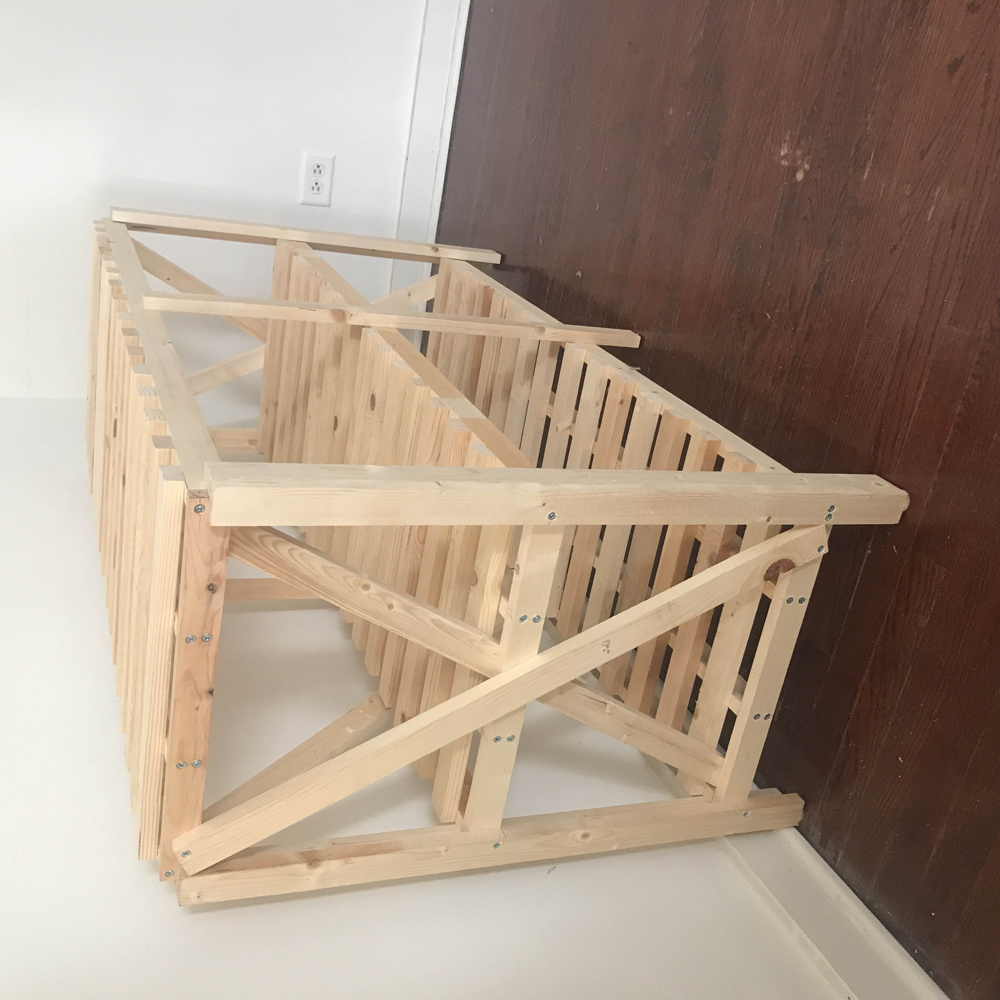
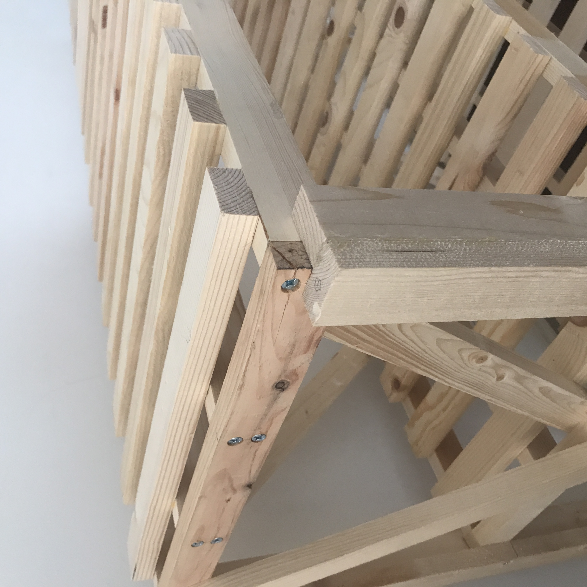
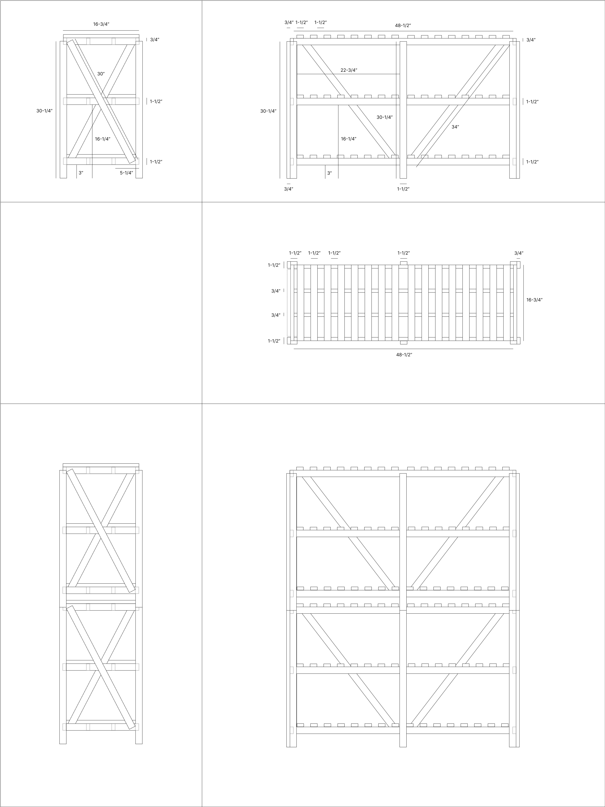

# storage-shelf

fits Hay's "recycled color crates", cubby dimentions are about 24"x11"x16" each

the design is stackable, legs are L-shaped, recessed corners lock the top shelf in place. stacking forms a thin shelf through the middle, good for prints, drawings, fabric patterns, skateboards or puzzles.

## construction

glue corner legs to into L-shapes, assemble left & right sides, then attach the long horizontal beams.

# materials

materials can be sourced from most lowes stores in the united states

- whitewood

  | W x H (in) | length (in) |	qty |
  | ---------- | ---------------- | --- |
  | 1 x 2 |	96 |	12 |
  | 1 x 2	| 72 |	13 | 
  
  (nominal measurements, actual WxH is 3/4" x 1-1/2")
    
- wood screws
  - #10 x 1-1/4"
  - #10 x 2"

# tools

while a miter saw & table saw will make the most accurate cuts, I was able to build this piece fairly easily with a small selection of hand tools.

- tape measure
- square
- pencil
- ryoba (japanese hand saw)
- low saw horses (DIY)
- clamps (4)
- power drill (+ impact driver)
- countersink or countersink bit
